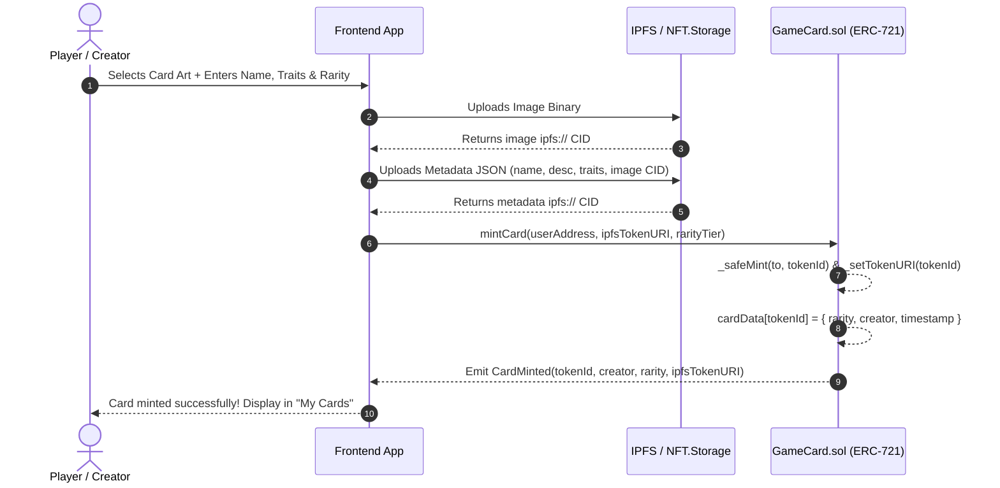

#  Rift Runners — Decentralized Game Card Marketplace

[](https://soliditylang.org/)
[](https://hardhat.org/)
[](https://openzeppelin.com/contracts/)
[](https://reactjs.org/)
[](https://vitejs.dev/)
[](https://docs.ethers.org/v6/)
[](https://ipfs.tech/)
[](https://sepolia.etherscan.io/)
[](LICENSE)

A high-performance decentralized application (dApp) for minting, listing, and trading fantasy trading card NFTs (ERC-721) on Ethereum EVM networks. Cards are minted with verifiable on-chain rarity tiers while high-resolution artwork and rich attribute metadata are stored permanently on the InterPlanetary File System (IPFS). Built with a **non-custodial** marketplace architecture where players retain custody of their cards until an atomic sale executes.

---

##  Table of Contents

- [Project Overview & Features](#-project-overview--features)
- [Tech Stack](#-tech-stack)
- [Setup Instructions](#-setup-instructions)
  - [Prerequisites](#prerequisites)
  - [Installation & Environment Configuration](#1-installation--environment-configuration)
  - [Compiling Contracts](#2-compiling-contracts)
  - [Running Automated Tests](#3-running-automated-tests)
  - [Local Deployment](#4-local-deployment)
  - [Sepolia Testnet Deployment](#5-sepolia-testnet-deployment)
  - [Running the Frontend](#6-running-the-frontend)
  - [Building for Production](#7-building-for-production)
- [Testnet & Contract Address](#-testnet--contract-address)
  - [Deployed Addresses (Sepolia)](#deployed-addresses-sepolia)
  - [Network Parameters](#network-parameters)
  - [Contract Architecture & Methods](#contract-architecture--methods)
- [IPFS Implementation](#-ipfs-implementation)
  - [Decentralized Storage Architecture](#decentralized-storage-architecture)
  - [NFT Metadata Schema](#nft-metadata-schema)
  - [Gateway Resolution](#gateway-resolution)
  - [CLI Upload Helper](#cli-upload-helper)
  - [Zero-Key Client-Side Fallback](#zero-key-client-side-fallback)
- [Project Structure](#-project-structure)
- [Architecture & Transaction Flow](#-architecture--transaction-flow)
- [Security & Design Patterns](#-security--design-patterns)
- [License](#-license)

---

##  Project Overview & Features

**Rift Runners** brings collectible card trading on-chain. Traditional gaming ecosystems lock digital items inside centralized databases where developers hold unilateral control over assets. Rift Runners guarantees true digital ownership: cards are non-fungible tokens owned directly in the player's wallet, with permanent decentralized media records that cannot be revoked or altered.

```
       [ Creator / Player ]
                 │
                 ├── 1. Upload Art & Metadata ───────► [ IPFS Network (CID) ]
                 │                                            │
                 ├── 2. Mint ERC-721 Card (tokenURI) ────────┼──► [ GameCard.sol ]
                 │                                            │         │
                 └── 3. Approve & List for Sale (Non-Custodial)        │
                                                              │         ▼
         [ Buyer ] ─── 4. Atomic Buy (ETH payment) ───────────┴──► [ Marketplace.sol ]
                                                                        │
                                       ┌────────────────────────────────┴──────────────────┐
                                       ▼                                                   ▼
                         [ Safe NFT Transfer to Buyer ]                       [ Payout to Seller - Fee ]
```

### Key Features

-  **Decentralized ERC-721 Minting (`GameCard.sol`)**
  - Mint custom fantasy creature cards with on-chain rarity indexing (`Common`, `Uncommon`, `Rare`, `Epic`, `Legendary`).
  - Immutable IPFS metadata URI binding via OpenZeppelin's `ERC721URIStorage`.
  - Creator provenance tracking (`creator`, `mintedAt`) recorded on-chain.
  - Enumerable on-chain queries via `ERC721Enumerable` for instant portfolio lookups without an external indexing dependency.

-  **Non-Custodial Marketplace (`Marketplace.sol`)**
  - Sellers never lock cards into an escrow contract while listed; cards remain in the player's wallet.
  - Sellers authorize the marketplace via standard ERC-721 `approve` or `setApprovalForAll`.
  - The listing remains open until sold, cancelled, or the owner transfers/burns the card.

-  **Atomic Sale & Settlement**
  - Cards and native ETH settle atomically in a single transaction via `buyCard`.
  - Payout is split automatically: seller proceeds are dispatched directly, while the protocol fee is credited to the contract owner.
  - Protected against reentrancy attacks using OpenZeppelin's `ReentrancyGuard` and Checks-Effects-Interactions pattern.

-  **Dynamic Listing Lifecycle**
  - **Price Revisions**: Sellers can adjust their asking price anytime without cancelling and relisting.
  - **Instant Cancellation**: Deactivate listings in one click with zero penalty.
  - **On-chain Discovery**: `getActiveListings()` dynamically aggregates currently active and valid listings.

-  **Seamless Web3 Wallet Experience**
  - Automatic provider and signer binding with MetaMask and all standard EIP-1193 EVM wallets.
  - Real-time network detection with automated chain switching prompts if the wallet is on the wrong network.
  - Reactive balance checks and address formatting.

-  **IPFS Card Art & Attributes Pipeline**
  - Upload artwork directly from the browser or via automated CLI scripts.
  - Generates OpenSea-compatible metadata schema with dynamic traits (Attack, Defense, Element, Rarity).
  - Robust multi-gateway resolution and zero-friction client-side Data URI fallback for instant testing.

---

##  Tech Stack

| Layer | Technology | Description |
|---|---|---|
| **Smart Contracts** | **Solidity `^0.8.24`** | Primary contract language with `cancun` EVM target and compiler optimization (200 runs) |
| **Standards & Libraries** | **OpenZeppelin Contracts `v5.0.2`** | Battle-tested implementations of `ERC721URIStorage`, `ERC721Enumerable`, `Ownable`, and `ReentrancyGuard` |
| **Development & Testing** | **Hardhat `v2.29.1`** | Ethereum development suite for compilation, local node simulation, debugging, and deployment |
| **Contract Tooling** | **Hardhat Toolbox `v5.0.0`** | Unified testing suite integrating Chai matchers, Mocha test runner, and network helpers |
| **Blockchain Client** | **Ethers.js `v6.13.1`** | Ethereum library for wallet interactions, contract RPC calls, and transaction signing |
| **Decentralized Storage** | **IPFS & NFT.Storage `v7.2.0`** | Content-addressed peer-to-peer storage protocol and API client for immutable art and metadata |
| **Frontend Framework** | **React `18.3.1`** | Component-driven UI layer with hooks-based Web3 state management |
| **Build Tooling** | **Vite `5.3.1`** | Next-generation frontend bundler providing lightning-fast HMR and optimized production bundles |
| **Styling** | **Modern Vanilla CSS** | Custom responsive design system featuring dark theme, glassmorphic surfaces, and card hover effects |
| **Target Network** | **Ethereum Sepolia Testnet** | Public EVM testnet for real-world transaction testing and contract verification |

---

##  Setup Instructions

### Prerequisites

Before setting up the project, ensure you have the following installed:

- **Node.js**: Version `18.x` or higher (`node -v`)
- **npm**: Version `9.x` or higher (`npm -v`)
- **Git**: (`git --version`)
- **MetaMask** (or compatible Web3 browser extension wallet)
- **Sepolia Testnet ETH**: Obtain testnet ETH from a public faucet:
  - [Google Cloud Web3 Sepolia Faucet](https://cloud.google.com/application/web3/faucet/ethereum/sepolia)
  - [Alchemy Sepolia Faucet](https://sepoliafaucet.com/)
  - [Infura Sepolia Faucet](https://www.infura.io/faucet/sepolia)

---

### 1. Installation & Environment Configuration

1. **Clone the repository:**
   ```bash
   git clone https://github.com/Rajarshisaha10/game-card-marketplace.git
   cd game-card-marketplace
   ```

2. **Install root dependencies (Hardhat, OpenZeppelin, Tooling):**
   ```bash
   npm install
   ```

3. **Configure root environment variables:**
   Create a `.env` file in the project root:
   ```bash
   cp .env.example .env
   ```
   Edit `.env` and fill in your values:
   ```env
   # RPC endpoint for the Sepolia testnet
   SEPOLIA_RPC_URL=https://ethereum-sepolia-rpc.publicnode.com

   # Private key of deployer wallet (TESTNET ONLY — never use a mainnet key)
   PRIVATE_KEY=your_private_key_here

   # Optional: Etherscan API key for contract verification
   ETHERSCAN_API_KEY=your_etherscan_key_here

   # NFT.Storage API key (get a free key at https://nft.storage)
   NFT_STORAGE_KEY=your_nft_storage_key_here
   ```

4. **Install frontend dependencies & configure frontend environment:**
   ```bash
   cd frontend
   npm install
   cp .env.example .env
   ```
   Edit `frontend/.env`:
   ```env
   # Contract addresses (pre-configured with Sepolia deployment)
   VITE_GAMECARD_ADDRESS=0x09384cEebBd6a78AB822c6006035175C836af58A
   VITE_MARKETPLACE_ADDRESS=0xc5EE55e8Ab2e7c6fe98E4F2D440051E52dB94E0f

   # Chain configuration (11155111 for Sepolia, 31337 for local Hardhat node)
   VITE_CHAIN_ID=11155111
   VITE_CHAIN_NAME=Sepolia

   # NFT.Storage API key for in-app minting uploads
   VITE_NFT_STORAGE_KEY=your_nft_storage_key_here

   # Public IPFS gateway for displaying card art and metadata in browser
   VITE_IPFS_GATEWAY=https://nftstorage.link/ipfs/
   ```
   Return to the project root:
   ```bash
   cd ..
   ```

---

### 2. Compiling Contracts

Compile the Solidity smart contracts with Hardhat:

```bash
npm run compile
```

Expected output:
```
Compiled 21 Solidity files successfully (evm target: cancun).
```

Artifacts and contract ABIs will be generated in `./artifacts` and synced into `./frontend/src/abis`.

---

### 3. Running Automated Tests

Run the full automated test suite containing **19 unit tests** covering card creation, metadata, listing validations, escrowless purchasing, fee distribution, and owner withdrawals:

```bash
npm test
```

Test coverage includes:
```text
  GameCard
    ✔ has the expected name and symbol
    ✔ mints a card with a unique token id, owner, and tokenURI
    ✔ increments token ids uniquely across mints
    ✔ rejects minting with an empty tokenURI
    ✔ enforces the mint price when set by the owner
    ✔ lists all cards owned by a given address
    ✔ only allows the owner to withdraw collected mint fees

  Marketplace
    ✔ lets an owner list a card they've approved to the marketplace
    ✔ rejects listing by a non-owner
    ✔ rejects listing without marketplace approval
    ✔ rejects a zero price listing
    ✔ allows a buyer to purchase a listed card, paying seller minus fee
    ✔ rejects purchase with incorrect payment amount
    ✔ rejects purchase of a card that is not listed
    ✔ allows the seller to cancel a listing
    ✔ prevents buying after the card was already sold to someone else
    ✔ lets the seller update the listing price
    ✔ returns only currently active listings from getActiveListings
    ✔ only allows the marketplace owner to change the fee, capped at 10%

  19 passing (2s)
```

---

### 4. Local Deployment

If you want to run a local development blockchain node for rapid offline testing:

1. **Start the local Hardhat node (Terminal 1):**
   ```bash
   npx hardhat node
   ```
   *This will spin up a local JSON-RPC server at `http://127.0.0.1:8545` (Chain ID `31337`) with 20 pre-funded test accounts.*

2. **Deploy contracts to the local node (Terminal 2):**
   ```bash
   npm run deploy:localhost
   ```
   Copy the printed `GameCard` and `Marketplace` contract addresses into `frontend/.env`, set `VITE_CHAIN_ID=31337`, and configure your MetaMask wallet to connect to `Localhost 8545`.

---

### 5. Sepolia Testnet Deployment

To deploy the contracts to the official Ethereum Sepolia testnet:

1. Ensure `SEPOLIA_RPC_URL` and `PRIVATE_KEY` are populated in `.env`, and your deployer address has Sepolia ETH.
2. Run the deployment script:
   ```bash
   npm run deploy:sepolia
   ```
3. The deployment script deploys `GameCard` (with initial 0 ETH mint fee), deploys `Marketplace` linked to the `GameCard` contract (with 250 bps / 2.5% protocol fee), and outputs the addresses:
   ```text
   Deploying contracts with account: 0x...
   GameCard deployed to: 0x09384cEebBd6a78AB822c6006035175C836af58A
   Marketplace deployed to: 0xc5EE55e8Ab2e7c6fe98E4F2D440051E52dB94E0f
   ```
4. Copy the new addresses into `frontend/.env`.

---

### 6. Running the Frontend

Launch the Vite development server:

```bash
cd frontend
npm run dev
```

Open your browser at `http://localhost:5173`. Connect your MetaMask wallet, switch to Sepolia testnet, and begin minting and trading cards.

---

### 7. Building for Production

Compile the production frontend bundle:

```bash
npm run build
```
Or from the project root:
```bash
npm run build
```
This produces an optimized client bundle in `frontend/dist` ready for static hosting on platforms like Vercel, Netlify, or IPFS/Fleek.

---

##  Testnet & Contract Address

The contracts are actively deployed and verified on the **Ethereum Sepolia Testnet**.

### Deployed Addresses (Sepolia)

| Contract | Type | Deployed Address | Block Explorer |
|---|---|---|---|
| **`GameCard`** | ERC-721 NFT Collection | `0x09384cEebBd6a78AB822c6006035175C836af58A` | [View on Sepolia Etherscan](https://sepolia.etherscan.io/address/0x09384cEebBd6a78AB822c6006035175C836af58A) |
| **`Marketplace`** | Non-Custodial Exchange | `0xc5EE55e8Ab2e7c6fe98E4F2D440051E52dB94E0f` | [View on Sepolia Etherscan](https://sepolia.etherscan.io/address/0xc5EE55e8Ab2e7c6fe98E4F2D440051E52dB94E0f) |

---

### Network Parameters

- **Network Name**: Sepolia Testnet
- **Chain ID**: `11155111` (Hex: `0xaa36a7`)
- **Native Currency**: Sepolia ETH (18 decimals)
- **Default RPC URL**: `https://ethereum-sepolia-rpc.publicnode.com`
- **Official Block Explorer**: `https://sepolia.etherscan.io`

---

### Contract Architecture & Methods

#### 1. `GameCard.sol` (ERC-721 Collection)
Inherits `ERC721URIStorage`, `ERC721Enumerable`, and `Ownable`.

```solidity
// Core public write methods
function mintCard(address to, string memory ipfsTokenURI, Rarity rarity) external payable returns (uint256)
function setMintPrice(uint256 newPrice) external onlyOwner
function withdraw() external onlyOwner

// Core public view methods
function totalMinted() external view returns (uint256)
function getCardsOwnedBy(address owner) external view returns (uint256[] memory)
function tokenURI(uint256 tokenId) public view returns (string memory)
function cardData(uint256 tokenId) external view returns (Rarity rarity, address creator, uint256 mintedAt)
```

- **Rarities**: `0: Common`, `1: Uncommon`, `2: Rare`, `3: Epic`, `4: Legendary`.
- **Rarity on-chain**: Stored in `cardData[tokenId]` so smart contracts and clients can query card rarity without making network requests to IPFS.

#### 2. `Marketplace.sol` (Trading Engine)
Inherits `ReentrancyGuard` and `Ownable`.

```solidity
// Core public write methods
function listCard(uint256 tokenId, uint256 price) external
function updatePrice(uint256 tokenId, uint256 newPrice) external
function cancelListing(uint256 tokenId) external
function buyCard(uint256 tokenId) external payable nonReentrant
function setFeeBps(uint256 newFeeBps) external onlyOwner

// Core public view methods
function getActiveListings() external view returns (uint256[] memory)
function listings(uint256 tokenId) external view returns (address seller, uint256 price, bool active)
function feeBps() external view returns (uint256)
function MAX_FEE_BPS() external view returns (uint256) // Capped at 1000 (10%)
```

---

##  IPFS Implementation

Decentralization is only as strong as its weakest link. Centralized web hosts (e.g. AWS S3, private web servers) introduce single points of failure where NFT images and traits can change, 404, or be censored. Rift Runners implements a complete **Content Addressed IPFS pipeline** ensuring card art and metadata are permanent, tamper-proof, and decentralized.

```
+-----------------------------------------------------------------------------------+
|                              IPFS UPLOAD PIPELINE                                  |
+-----------------------------------------------------------------------------------+

 1. Card Artwork (PNG/JPEG/WebP)
    └── Uploaded via NFT.Storage / IPFS Node
    └── Generates Image CID:
        ipfs://bafybeicardimagecid123456789...

 2. ERC-721 Metadata JSON Formulation
    {
      "name": "Flamewing Drake",
      "description": "A juvenile drake wreathed in restless embers.",
      "image": "ipfs://bafybeicardimagecid123456789...",
      "attributes": [
        { "trait_type": "Attack", "value": "78" },
        { "trait_type": "Defense", "value": "54" },
        { "trait_type": "Element", "value": "Fire" },
        { "trait_type": "Rarity", "value": "Epic" }
      ]
    }

 3. Metadata Pinning
    └── JSON file pinned to IPFS
    └── Generates Metadata CID:
        ipfs://bafybeimetadatacid987654321...

 4. Smart Contract Binding
    └── Passed directly to GameCard.mintCard(to, "ipfs://bafybeimetadatacid...", rarity)
    └── On-chain tokenURI immutable link established
```

---

### Decentralized Storage Architecture

The application handles IPFS storage via two primary mechanisms:

1. **In-App Direct Minting (`frontend/src/utils/ipfs.js`)**:
   Uses the client-side `nft.storage` library to bundle card image binary blobs and JSON metadata directly from the player's browser. The returned `ipfs://` protocol URI is immediately passed into the mint transaction.
2. **Automated CLI Tooling (`scripts/uploadToIpfs.js`)**:
   Enables creators or automated game pipelines to batch-upload card art and metadata directly from the command line prior to batch-minting.

---

### NFT Metadata Schema

Metadata JSON generated by Rift Runners follows the OpenSea and ERC-721 standard metadata specifications:

```json
{
  "name": "Flamewing Drake",
  "description": "A juvenile drake wreathed in restless embers, scouring the volcanic crags of Mount Cinder.",
  "image": "ipfs://bafybeicardimagecid123456789/flamewing-drake.png",
  "attributes": [
    { "trait_type": "Attack", "value": "78" },
    { "trait_type": "Defense", "value": "54" },
    { "trait_type": "Speed", "value": "61" },
    { "trait_type": "Element", "value": "Fire" },
    { "trait_type": "Rarity", "value": "Epic" }
  ]
}
```

---

### Gateway Resolution

Browsers cannot natively resolve the `ipfs://` protocol without a specialized IPFS extension or node. The dApp incorporates an IPFS-to-HTTP converter (`frontend/src/utils/contracts.js`):

```javascript
export function ipfsToHttp(uri) {
  if (!uri) return "";
  if (uri.startsWith("ipfs://")) {
    return IPFS_GATEWAY + uri.replace("ipfs://", "");
  }
  return uri;
}
```

- **Configured Public Gateway**: `https://nftstorage.link/ipfs/`
- **Fallback Compatible Gateways**: `https://ipfs.io/ipfs/`, `https://cloudflare-ipfs.com/ipfs/`, or any dedicated IPFS gateway node.

In `frontend/src/utils/metadata.js`, responses are cached in-memory (`Map<tokenURI, json>`) to minimize redundant network requests and maximize UI responsiveness.

---

### CLI Upload Helper

A dedicated node script allows developers to pin card assets to IPFS from the terminal:

```bash
NFT_STORAGE_KEY=your_key_here node scripts/uploadToIpfs.js \
  --image ./art/flamewing-drake.png \
  --name "Flamewing Drake" \
  --description "A juvenile drake wreathed in restless embers." \
  --rarity Epic \
  --attributes "Attack:78,Defense:54,Speed:61,Element:Fire"
```

Output:
```text
 Uploaded to IPFS
Metadata URI (pass as ipfsTokenURI to mintCard): ipfs://bafyreib2.../metadata.json
Gateway preview: /ipfs/bafyreib2.../flamewing-drake.png
```

---

### Zero-Key Client-Side Fallback

To ensure seamless developer testing and zero-friction onboarding even without an active NFT.Storage account or during third-party gateway downtime, `frontend/src/utils/ipfs.js` implements a **client-side Data URI fallback engine**:

1. If `VITE_NFT_STORAGE_KEY` is not present, the user's uploaded image is compressed and converted into a compact WebP Data URL using HTML5 Canvas (`fileToOptimizedDataUrl`).
2. The complete metadata payload is serialized into a self-contained Base64 Data URI (`data:application/json;base64,...`).
3. The card mints on-chain identically, and `fetchCardMetadata()` decodes Base64 data instantly with zero external network dependencies.

---

##  Project Structure

```text
game-card-marketplace/
├── contracts/                     # Solidity smart contracts
│   ├── GameCard.sol               # ERC-721 token contract with on-chain rarity and URI storage
│   └── Marketplace.sol            # Non-custodial listing, price update, and buying contract
├── scripts/                       # Deployment and operational scripts
│   ├── deploy.js                  # Deployment script for Localhost and Sepolia testnet
│   └── uploadToIpfs.js            # CLI script to pin card artwork & metadata to IPFS
├── test/                          # Smart contract automated test suite
│   ├── GameCard.test.js           # Tests for minting, tokenURI, ownership, and owner controls
│   └── Marketplace.test.js        # Tests for listings, non-custodial buy, fee split, cancel
├── frontend/                      # React + Vite Web3 Frontend application
│   ├── public/                    # Static assets
│   ├── src/
│   │   ├── abis/                  # Contract ABIs generated by Hardhat
│   │   │   ├── GameCard.json
│   │   │   └── Marketplace.json
│   │   ├── components/            # Modular React components
│   │   │   ├── CardTile.jsx       # Individual card display with rarity styling & action buttons
│   │   │   ├── Marketplace.jsx    # Active listings gallery with dynamic filters & buy actions
│   │   │   ├── MintForm.jsx       # Card creation form with IPFS upload & trait builders
│   │   │   ├── MyCards.jsx        # Connected wallet inventory, card listing, and approvals
│   │   │   └── WalletBar.jsx      # Wallet connection header, balance, & network switch
│   │   ├── utils/                 # Web3 and IPFS helper utilities
│   │   │   ├── contracts.js       # Contract factories, addresses, and IPFS gateway resolution
│   │   │   ├── ipfs.js            # NFT.Storage upload integration and Data URI fallback
│   │   │   ├── metadata.js        # Cached card metadata fetching and parsing
│   │   │   └── useWallet.js       # React custom hook for EIP-1193 wallet management
│   │   ├── App.jsx                # Main application layout and navigation tabs
│   │   ├── main.jsx               # React DOM entry point
│   │   └── styles.css             # Comprehensive CSS design system (glassmorphism & dark UI)
│   ├── .env.example               # Example frontend environment variables
│   ├── index.html                 # HTML shell with viewport and SEO meta tags
│   ├── package.json               # Frontend dependencies and scripts
│   └── vite.config.js             # Vite configuration with React plugin
├── .env.example                   # Example root environment variables
├── hardhat.config.js              # Hardhat configuration (Solidity 0.8.24, Sepolia network)
├── package.json                   # Root package definitions and test scripts
└── README.md                      # Comprehensive project documentation
```

---

##  Architecture & Transaction Flow

### 1. Minting Flow


### 2. Listing & Purchase Flow (Non-Custodial)
```mermaid
sequenceDiagram
    autonumber
    actor Seller
    actor Buyer
    participant UI as Frontend App
    participant GC as GameCard.sol
    participant MP as Marketplace.sol

    Note over Seller,GC: Step 1: Listing
    Seller->>UI: Enter sale price (e.g. 0.05 ETH)
    UI->>GC: approve(MarketplaceAddress, tokenId)
    UI->>MP: listCard(tokenId, price)
    MP-->>MP: Validate ownership & approval; record listing
    MP-->>UI: Emit CardListed(tokenId, seller, price)

    Note over Buyer,MP: Step 2: Atomic Purchase
    Buyer->>UI: Click "Buy Card" (sends 0.05 ETH)
    UI->>MP: buyCard(tokenId) { value: 0.05 ETH }
    MP-->>MP: Verify listing.active && msg.value == listing.price
    MP-->>MP: listing.active = false (Checks-Effects)
    MP->>GC: safeTransferFrom(seller, buyer, tokenId)
    MP->>Seller: Transfer (price - protocolFee) ETH
    MP->>MP: Retain protocolFee in contract
    MP-->>UI: Emit CardSold(tokenId, seller, buyer, price)
    UI-->>Buyer: NFT transferred into your wallet!
```

---

##  Security & Design Patterns

1. **Non-Custodial Escrowless Model**:
   Traditional marketplaces hold tokens in custody, creating massive honeypots for exploiters. Rift Runners never takes custody of NFTs. The contract is granted standard ERC-721 approval and only executes transfer when payment is fully supplied.
2. **Checks-Effects-Interactions & ReentrancyGuard**:
   The `buyCard` method updates the internal listing state (`active = false`) *before* initiating external token transfers or sending ETH proceeds. Inheriting OpenZeppelin's `ReentrancyGuard` with the `nonReentrant` modifier guarantees immunity against reentrant callbacks.
3. **Strict Parameter Validation**:
   - Zero price listings are rejected (`price > 0`).
   - Mismatched payments revert (`msg.value == listing.price`).
   - Unapproved listings cannot be submitted.
   - Secondary verification checks that the seller still owns the card at the exact moment of sale.
4. **Capped Protocol Fees**:
   The marketplace protocol fee is hardcoded to a maximum of 10% (`MAX_FEE_BPS = 1000`), preventing administrative fee abuse.
5. **On-Chain Rarity Indexing**:
   Rarities are stored in contract storage as well as IPFS, preventing client-side spoofing and enabling trustless on-chain card tournament gating or mechanics.

---

